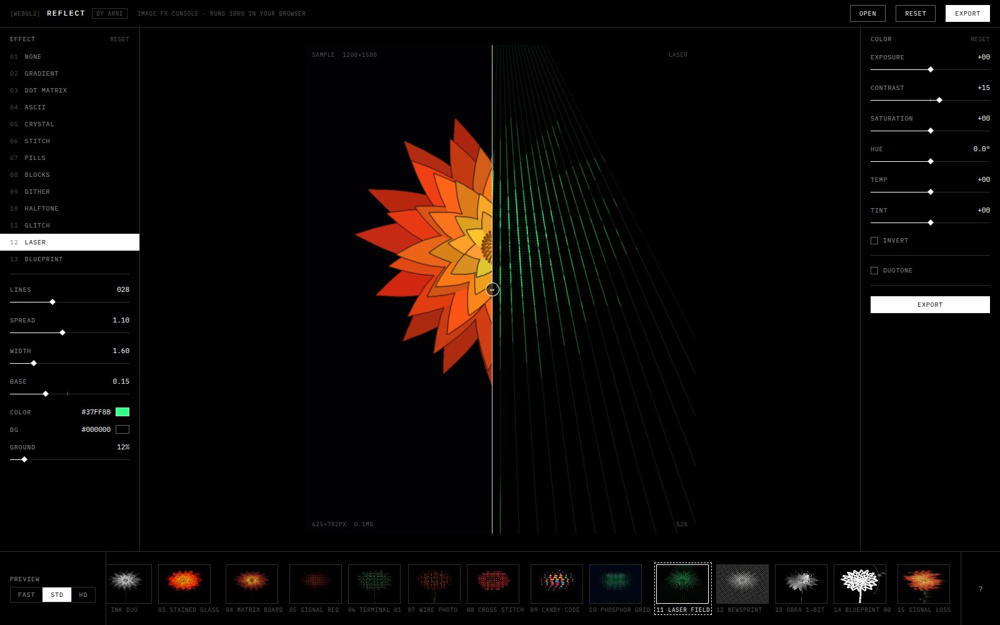
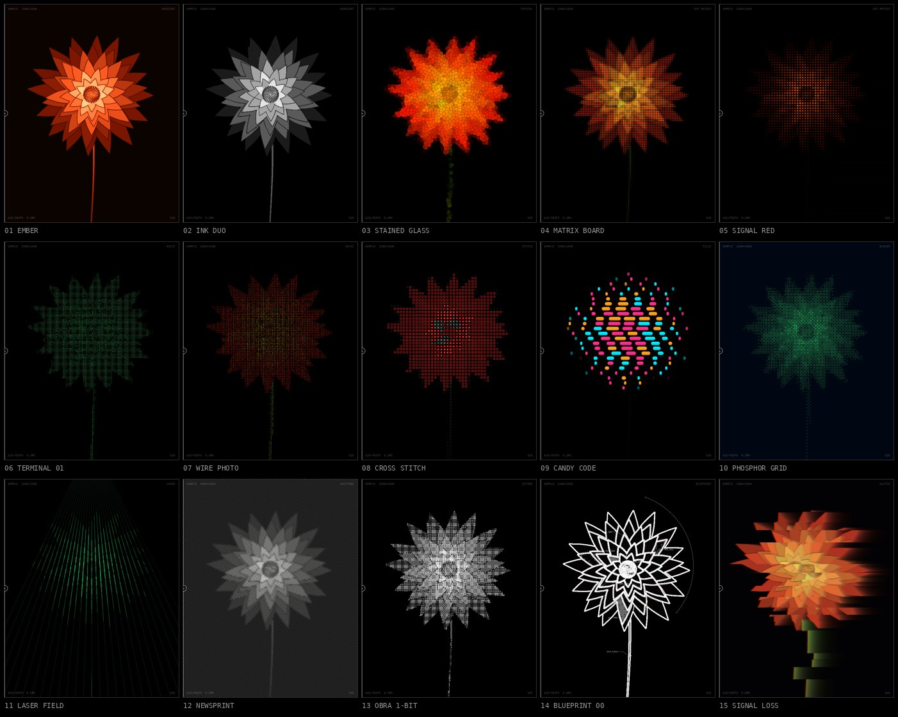

# REFLECT

Minimal, Ryoji-Ikeda-styled image effects console. Everything runs locally in
your browser — WebGL2 shaders, no backend, no uploads.





## Features

- **13 GPU effects** — gradient map, dot matrix, ASCII, crystal/voronoi,
  cross-stitch, pill mosaic, terminal blocks, dither (Bayer +
  Floyd–Steinberg/Atkinson), halftone, glitch, laser field, blueprint
  annotations, plus a pure color pass
- **Image GROUND** — mark effects composite over a treated version of your
  photo, so the result reads as the picture *transformed*, not marks on a void
- **Curated presets** with live thumbnails rendered on *your* image
- **Understandable color** — exposure / contrast / saturation / hue /
  temperature / tint / invert + duotone mapping, applied before every effect
- **Before/after wipe** slider right on the canvas; hold `SPACE` for the original
- **Fast in, fast out** — drag & drop, paste from clipboard, or open a file;
  export PNG / JPEG / WebP at 1–4× (seam-free tiled rendering up to the GPU
  limit), transparent background for mark-style effects, copy to clipboard,
  system share sheet, and a "look link" that encodes your settings in the URL
- **Ikeda UI** — pure black & white, hairlines, IBM Plex Mono, data readouts

## Run

```sh
npm install
npm run dev      # local dev server
npm run build    # production build in dist/ (static, host anywhere)
```

## Architecture

```
source texture (mipmapped)
  → color grade (inside every shader via srcAt/cellColor sampling)
  → effect pass(es), ping-pong FBOs        src/shaders/effects/*.frag
  → composite (wipe compare) → canvas      src/shaders/composite.frag
```

- All shader geometry is computed in **global output pixels**
  (`uTileOrigin + gl_FragCoord`), so exports render in 2048² tiles with zero
  seams at any scale.
- Cell-based effects sample the cell's average color with one `textureLod`
  tap on the mipmapped source.
- Error-diffusion dithering runs in a Web Worker; the GPU renders a Bayer
  approximation live while the worker computes.
- Effects are declared as data (`src/effects/defs/*.ts`): shader + uniform
  mapping + control schema. The UI renders itself from the schema.

## Keys

`1–9 0` effects · `SPACE` original · `[ ]` wipe · `P` presets · `O` open ·
`E` export · `C` copy image · `L` copy look link · `R/⇧R` reset · `F` quality ·
`?` help
